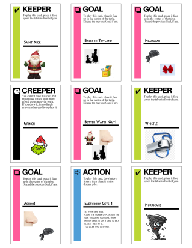

# Fluxx Deck Maker #

Fluxx_maker builds printer-ready images of Fluxx cards from a csv template file,


[Fluxx](https://www.looneylabs.com/games/fluxx) is a terrific card game by Looney Labs.
There are currently over two dozen themed decks for sale.
This utility allows you to create your own.

### How it works ###

Currently, Fluxx_maker reads in a template csv file,
where each row describes a card in three columns:
the card's Name, Type, and either a Description or (for a Keeper or Creeper type)
the name of an Image, or (for a Goal) the name of the required Keepers and Creepers.


Fluxx_maker then uses Piilow to
load the appropriate template for the card's Type,
write the Name at the top of the card 
and either write the Description
or draw the card's Image on the bottom of the card.

After Fluxx_maker has written each card to the deck directory,
It copies 3 x 3 cards onto a printer-ready Page image,
generating as many Page images as necessary to print the entire deck.



### Todo ###

* Allow special powers to Keeper/Creeper cards.
* Allow unique images for Goal cards.
* Print a summary of Goals per Keeper/Creeper to aid in balancing the deck.

### How do I get set up? ###

```bash
python -m venv venv
pip install -r requirements.in
source venv/bin/activate

./fluxx_maker <input_directory>
```

### Written by ###

John Lee Cooper  
john.lee.cooper@gatech.edu
  
